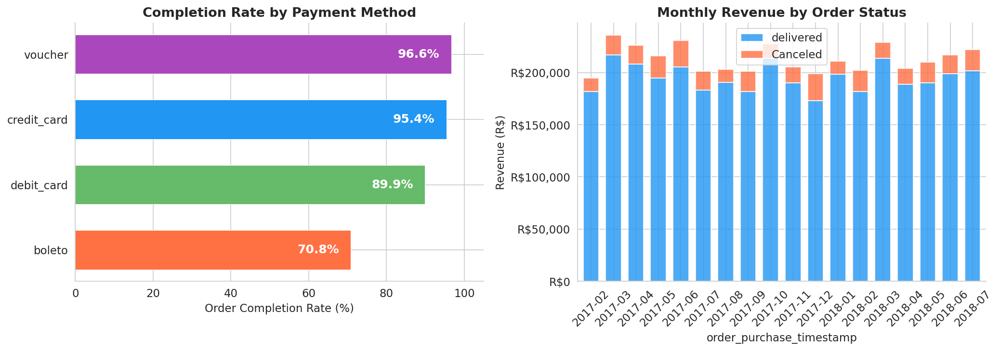
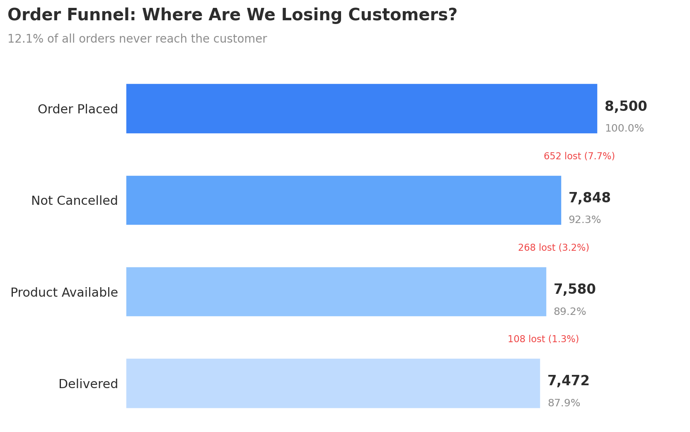
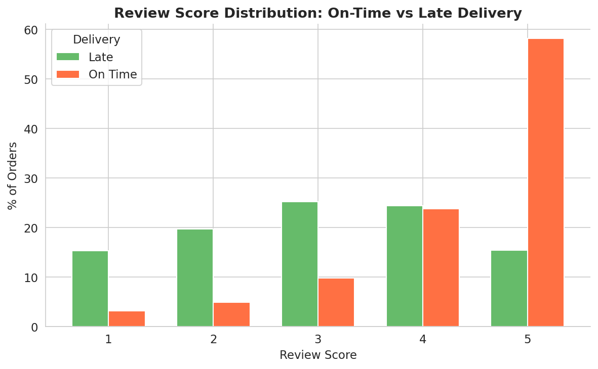
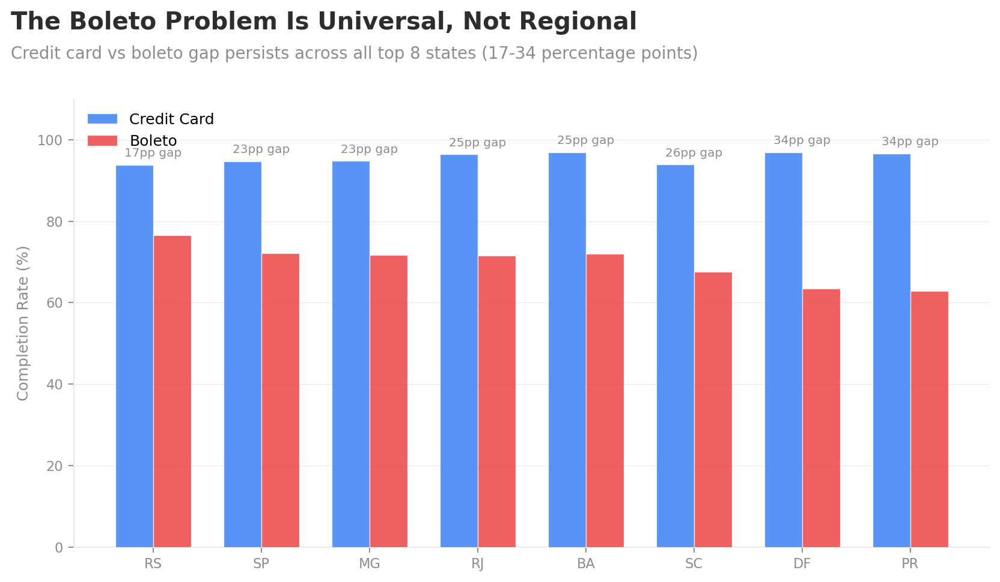
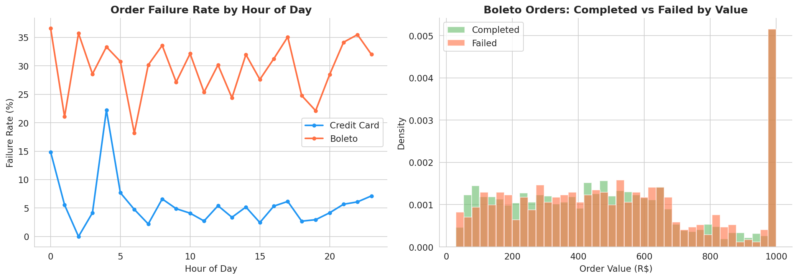
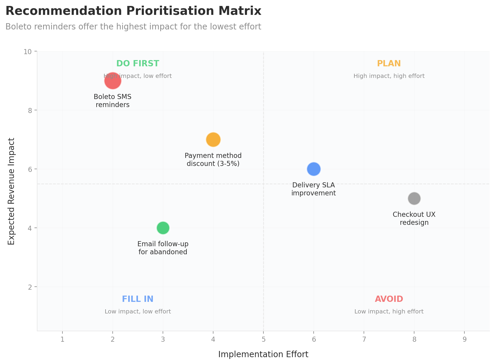

# Where Exactly Is This E-Commerce Store Bleeding Money?

I picked up this dataset expecting the usual story: checkout is confusing, users bounce, redesign the page. That's not what I found. The real problem was hiding in the payment method data, and it took me by surprise.

## What this project is about

An online marketplace in Brazil processes thousands of orders every month. A meaningful percentage of those orders never actually get delivered. The product team believed the checkout experience was the issue. I wanted to see if the data agreed with that theory before anyone committed engineering hours to fixing it.

It didn't.

## The dataset

I worked with the Olist Brazilian e-commerce public dataset. 8,500 orders placed by 6,200 customers between January 2017 and August 2018. Three tables: orders (with status, timestamps, and customer location), order items (with product categories and pricing), and order payments (with payment method, instalments, and transaction value).

The data is messy in the way real transactional data tends to be. Missing delivery dates for cancelled orders, inconsistent timestamp formats, and review scores that only exist for delivered orders. I cleaned everything in Python before running any analysis.

## What tools did I use and why

I used **Python** (pandas, matplotlib, seaborn) for the bulk of the analysis because I needed to merge three tables, handle missing values, and create calculated fields like delivery latency and order completion flags. I wrote **SQL** queries first to explore the data quickly and test hypotheses before committing to the full Python pipeline. The final dashboard export is formatted for **Power BI**, and I did initial data profiling in **Excel** to get a feel for distributions before writing any code.

## My hypotheses going in

Before touching the data, I wrote down three assumptions I expected the analysis to confirm:

**Hypothesis 1:** The checkout flow is the primary bottleneck, with drop offs spread across multiple stages.

**Hypothesis 2:** Higher value orders would have higher abandonment rates (price shock effect).

**Hypothesis 3:** Geographic differences in delivery time would be the main driver of cancellations.

All three turned out to be wrong. That's what made this analysis worth doing.

## What I actually found

### Finding 1: The checkout flow isn't the problem. One payment method is.

When I broke down order completion rates by payment type, the pattern was immediately obvious:

| Payment Method | Orders | Completion Rate | Cancellation Rate |
|---------------|--------|:--------------:|:-----------------:|
| Voucher | 704 | 96.6% | 3.4% |
| Credit Card | 4,431 | 95.4% | 2.9% |
| Debit Card | 958 | 89.9% | 6.1% |
| Boleto (bank slip) | 2,407 | 70.8% | 18.4% |

Boleto is a Brazilian payment method where the customer receives a bank slip after placing an order and then has to go pay it separately, usually within 3 to 5 days. If they don't pay in time, the order dies.

The completion rate for boleto is 25 percentage points lower than credit card. Boleto makes up 28% of all orders but accounts for roughly 58% of all failures. That's not a checkout problem. That's a payment method problem.



### Finding 2: This is costing R$380,000 in lost revenue

703 boleto orders failed during the analysis period. Total lost revenue: R$380,422. The average failed boleto order was worth R$541, so these aren't trivial transactions being abandoned.

A conservative 30% recovery rate would bring back R$114,127. To put that in context, recovering existing failed orders is almost certainly cheaper than acquiring equivalent revenue through new customer acquisition.

### Finding 3: The order funnel tells a clear story when you look at it properly



The biggest single drop happens at the cancellation stage, where 7.7% of all orders are lost. When I filtered by payment type, boleto orders accounted for the overwhelming majority of those cancellations. The rest of the funnel (product availability, processing) loses a relatively small percentage.

To quantify exactly where effort should go: **cancellation accounts for 63% of total funnel loss, product unavailability for 26%, and processing failures for 11%.** This is not a distributed problem. It's concentrated, which means it's fixable.

### Finding 4: Late deliveries are quietly damaging customer retention

This wasn't part of my original question, but it jumped out of the data. For orders that do complete successfully:

| Delivery Status | Average Review Score |
|----------------|:-------------------:|
| On time | 4.29 out of 5 |
| Late | 3.05 out of 5 |

That's a 1.24 star drop. And roughly half of all deliveries are arriving late. This won't cause cancellations today, but customers who receive late orders and leave poor reviews are far less likely to come back. It's a slow leak.



## Segmented analysis: testing whether the problem is uniform

A top level finding is only useful if you know whether it applies universally or hides behind an average. I broke the data down three ways to check.

### By geography



The boleto failure rate varies by state, but the credit card vs boleto gap is consistent everywhere. In Paraná and Distrito Federal the gap reaches 34 percentage points. Even in Rio Grande do Sul, where boleto performs best, the gap is still 17 points. The problem is structural to the payment method, not specific to any region.

### By time of day and day of week

Boleto failure rates are slightly higher for orders placed on weekends (30.5% vs 27.1% on Wednesdays). My interpretation: weekend impulse purchases are more likely to cool off before the customer gets around to paying the bank slip. This suggests timing the reminder to arrive on Monday morning for weekend orders could be effective.

### By order value

Failed and completed boleto orders have similar value distributions. High value orders don't fail at notably different rates than low value ones. This disproves my second hypothesis (price shock effect) and confirms that payment friction affects everyone equally regardless of order size.



## My recommendations, prioritised by effort and impact

If I were presenting this to the product team, I wouldn't just list suggestions. I'd rank them so the team knows what to do first, what to plan for later, and what to skip entirely.



| Recommendation | Impact | Effort | Priority |
|---------------|:------:|:------:|:--------:|
| Boleto SMS and email reminders 24h before expiry | High | Low | Do first |
| 3 to 5% discount for instant payment methods | High | Medium | Do second |
| Delivery SLA improvement for northern states | Medium | High | Plan |
| Checkout UX redesign | Low | High | Deprioritise |

**Why I'd deprioritise the checkout redesign:** The data shows the failure is payment method specific, not checkout flow wide. A redesign would consume significant engineering time without addressing the root cause. I'd push back on this if it were already in the roadmap.

**Why boleto reminders should go first:** Lowest effort (an automated SMS and email sequence), highest expected impact (15 to 20% recovery based on similar fintech implementations), and directly addresses the root cause. Estimated revenue recovery: R$57,000 to R$76,000 annually.

## How I'd validate these recommendations

Recommendations without a testing plan are just opinions. Here's how I'd propose validating each one:

**Experiment 1: Boleto reminder timing.** Run an A/B test with three groups. Group A receives a reminder 24 hours before boleto expiry. Group B receives it 48 hours before. Group C (control) receives no reminder. Primary metric: boleto completion rate. Sample size needed: roughly 500 boleto orders per group to detect a 5 percentage point improvement with 95% confidence. Estimated run time: 3 to 4 weeks.

**Experiment 2: Payment method discount.** Test whether a 3% discount for credit card payment shifts boleto users. Show the discount on the payment selection page for 50% of users (treatment) vs no discount (control). Primary metric: share of orders using credit card. Secondary metric: overall completion rate. Watch out for: margin impact if the discount erodes profit without improving completion.

**Experiment 3: Reminder content.** Once we know reminders work, test urgency framing ("your order expires tomorrow") vs incentive framing ("complete payment and get free shipping on your next order"). Primary metric: boleto conversion rate. This is a lower-priority experiment that only makes sense after Experiment 1 confirms the baseline impact.

## Where I'd take this with more data

This analysis has clear limits. Here's what I'd want to investigate next if I had access to more granular data:

**Customer level cohort analysis.** Do repeat customers complete boleto orders at higher rates than first-time buyers? If so, the problem might partially resolve itself as the customer base matures.

**Boleto payment timeline data.If I can see when customers actually pay their boletos (day 1 vs day 3 vs never), I can determine the optimal reminder timing instead of guessing at 24 hours.

**Session level data.** With clickstream data I could see whether boleto users browse differently (more price comparison, less decisive) which would help design better interventions.

**Lifetime value by payment method.** Are credit card customers more valuable over their full relationship with the platform, or do they complete individual orders more reliably?

## Project structure

```
data/
    olist_orders.csv
    olist_order_items.csv
    olist_order_payments.csv
    powerbi_ready_export.csv
notebooks/
    analysis.py
sql/
    funnel_queries.sql
visualisations/
    01_payment_completion_rates.png
    02_order_funnel.png
    03_boleto_deep_dive.png
    04_delivery_vs_reviews.png
    05_prioritisation_matrix.png
    06_geographic_segmentation.png
README.md
```

## How to run this

```bash
git clone https://github.com/hritu-analytics/ecommerce-funnel-analysis.git
cd ecommerce-funnel-analysis
pip install pandas matplotlib seaborn numpy
cd notebooks
python analysis.py
```

---

Built by Hrituparna Das | MS Business Analytics
Currently looking for Data Analyst, Business Analyst, and Marketing Analytics roles.
[Connect on LinkedIn](https://www.linkedin.com/in/hrituparna-das)
